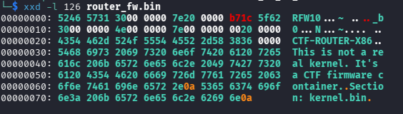
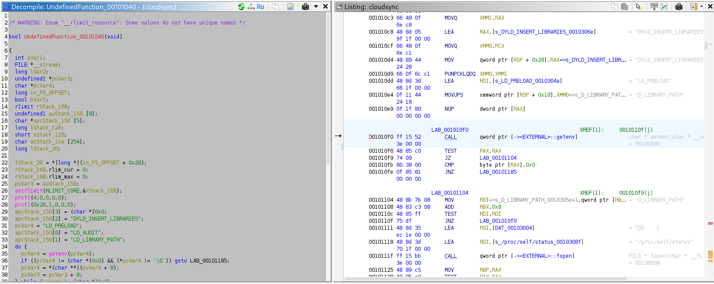
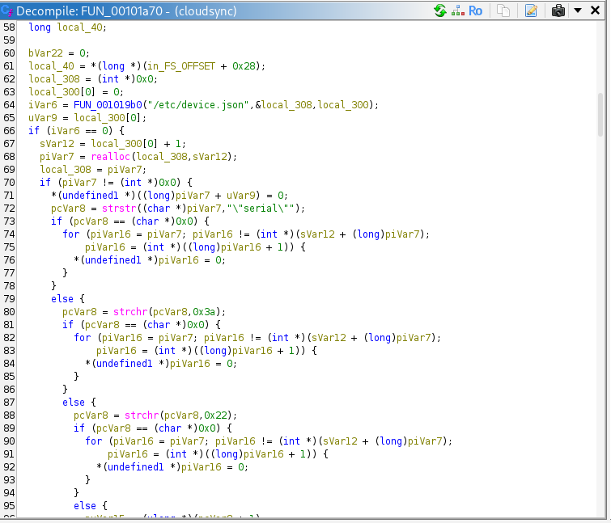
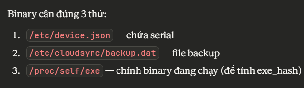

# Iot_ez_or_hard

## Đề bài
You have been provided with a firmware update package for the router “CTF-Router-X86”.
Người ra đề cung cấp 1 file router_fw.bin.

## Cách giải
File được cho là một file firmware router x86. Em dùng binwalk để extract file thì được 1 file chứa squashfs-root. Ở đây không có kernel vì đây chỉ là một container.

Trong thư mục sau khi extract có 3 file quan trọng là:
usr/sbin/cloudsync, etc/device.json và etc/cloudsync/backup.dat.

Em chạy thử cloudsync thì ko thấy nó có gì thay đổi cả. Do đó em thử phân tích tĩnh file cloudsync bằng Ghidra. Em tìm được hàm main dưới đây:

Đoạn đầu hàm main là cơ chế anti-debug, đoạn cuối có 1 hàm quan trọng hơn:

1. Cách "hard":

Em sử dụng AI phân tích hàm này thì nhận được cơ chế toán học sử dụng SHA256 (hàm băm trả về 32 bytes từ input bất kì, không phục hồi lại được input). Cơ chế toán học này sử dụng serial của file .json, file backup.dat và /proc/self/exe của chính binary đang chạy:

Cùng với đó, AI cho em một script python giúp tự tính được flag. Nhiệm vụ của em chỉ là tìm những tham số được yêu cầu. Tuy vậy, cách này yêu cầu crypto rất lớn và khác phức tạp nên em nghĩ đây là cách "hard".

2. Cách "ez":

Về phía cách "ez", em có nghĩ đến được để cho chính cloudsync tự tính tất cả cho mình, mình chỉ cần nắm bắt được flag khi nó ở trong RAM. Em có sử dụng gdb để chạy thử tuy vậy cũng ko thu được gì. 