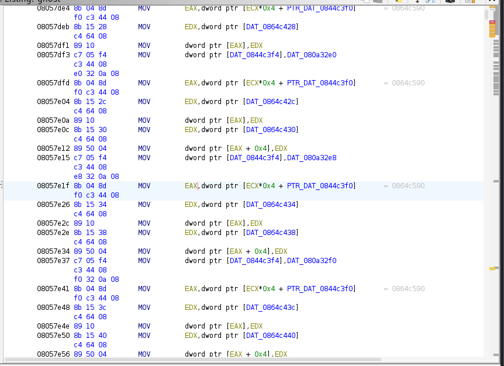
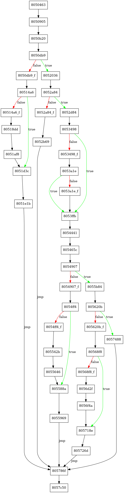

# Ghost

## Đề bài
Đề bài cho ta một file ghost

## Những gì đã làm được
Trước hết em xác định file ghost là file như thế nào bằng lệnh "file" thì thu được "ghost: ELF 32-bit LSB executable, Intel i386, version 1 (SYSV), dynamically linked, interpreter /lib/ld-linux.so.2, stripped
". Em chạy thử bằng máy ảo kali linux thì nó hiện ra 1 đoạn "Enter passcode:", nhập code thử vào thì chương trình chạy khá lâu rồi không in ra gì, cùng với đó file này biến mất. Chính vì vậy, sau khi tải lại em khóa file lại tránh cho việc mất đi file sau khi chạy

*Phân tích tĩnh:

Em sử dụng Ghidra để phân tích tĩnh thì thu được như sau:

Hợp ngữ sau khi phân tích tĩnh thu được toàn lệnh mov. Đây chính là phương pháp movfuscator (chuyển tất cả các lệnh về những lệnh mov). Nhờ tìm kiếm chuỗi kí tự "Enter passcode" nên em tìm được cả địa chỉ của chuỗi "Access Granted". Tuy vậy, phân tích tĩnh cũng không thu được gì

Tiếp theo, em sử dụng tool [demov](https://github.com/leetonidas/demovfuscator) để demov thử file, rồi mở lại bằng Ghidra cũng không thu được gì. Tool này còn giúp em tìm đc code flow của chương trình:

*Phân tích động:
Em thử phân tích động bằng gdb file đã demov. Theo như code flow có các nhánh true, em đi theo các nhánh true bằng cách đổi đến được đoạn "Access Granted" nhưng cũng không có gì xảy ra, kiếm tra các thanh ghi cũng không thu được gì. Em break tại các chỗ rẽ nhánh để đếm số hit breaks cho từng kí tự nhập vào cũng không thu được gì do có vẻ dù nhập input thế nào thì chương trình vẫn chạy như vậy.
