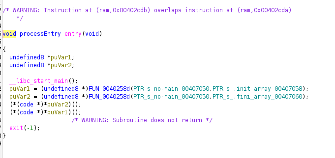
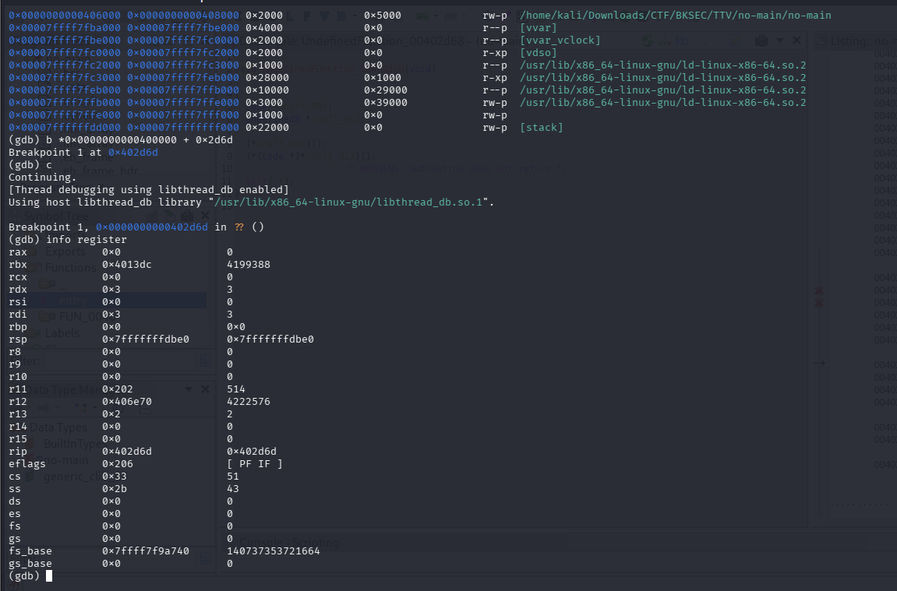
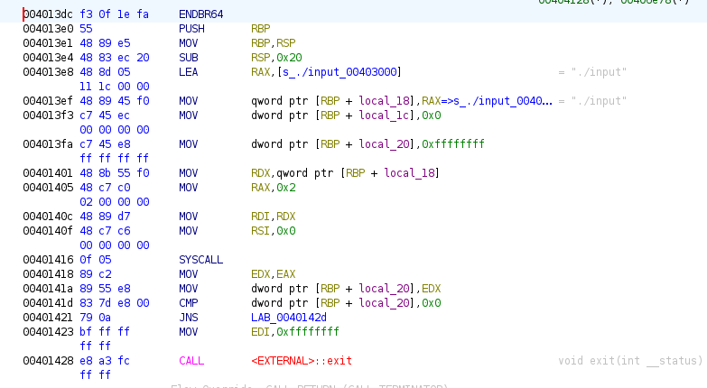
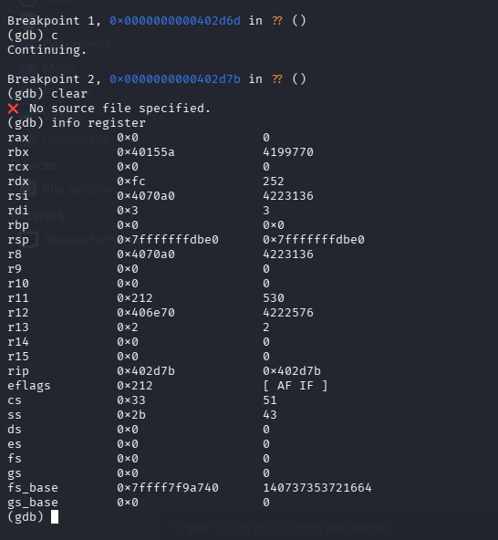
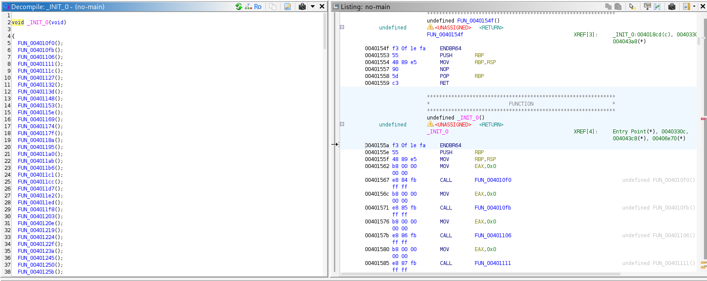
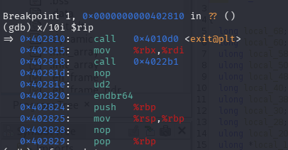
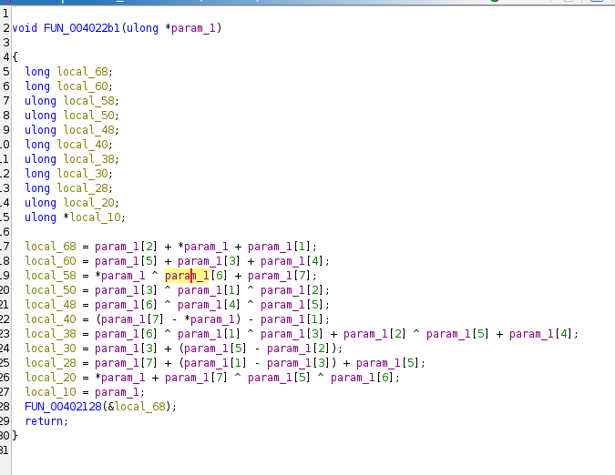

# No-main
## Đề bài
Ta được cho 1 file thực thi no-main

## Cách giải
Trước hết em sử dụng xem file thực thi như thế nào bằng lệnh file thì nhận được như sau:
```bash
└─$ file no-main   
no-main: ELF 64-bit LSB executable, x86-64, version 1 (SYSV), dynamically linked, interpreter /lib64/ld-linux-x86-64.so.2, BuildID[sha1]=7be119e8c78aed1cc27b23bfbfdf65918c03e3a0, stripped
```
Em chạy thử bằng kali thì không có gì hiện ra. Vì vậy, em sử dụng Ghidra để phân tích tĩnh. Hàm entry thu được như sau:



Hai lời gọi hàm đầu là để khởi tạo. Hai hàm sau thì không thể double click vô xem được. Vì thế, em sử dụng gdb để phân tích động 2 hàm này. Trước hết với hàm đầu tiên: 



Trong Ghidra, lệnh ASM CALL thanh ghi RBX, ta thấy RBX ở đây có giá trị 0x4013dc, vậy hàm tiếp theo được gọi ở địa chỉ này. Mở lại Ghidra ta tìm được hàm sau: 



Hàm này đọc 1 file có tên input, mà trong thư mục chưa có file nào nên em add thêm 1 file vào để chương trình chạy tiếp.
Tiếp tục đến hàm thứ 2:



Thanh ghi RBX lúc này có giá trị là 0x40155a, em sẽ xem trong Ghidra hàm ở vị trí này: 



Hàm này gọi rất nhiều các hàm khác, em xem một số hàm đầu thì nó chỉ return chứ ko có tác dụng gì. Em cho gdb chạy tiếp thì nó trả về exit code 0377. Có lẽ trong số các hàm ở trên có hàm làm chương trình exit. Vì vậy em đặt breakpoint exit 
```bash
b exit
```

rồi cho chạy lại chương trình. Khi chương trình exit, em dùng lệnh 
```bash 
bt
```

để xem lại địa chỉ câu lệnh trước khi chương trình bị exit. Địa chỉ ta thu được là 0x0000000000402815 nên em đặt thêm 1 breakpoint ở 0x0000000000402810. Khi hit breakpoint tại đây, em xem các lệnh tiếp theo của thanh ghi RIP thì thu được như sau:


Vậy hàm làm exit chương trình ở địa chỉ 0x4022b1, mở hàm này trong Ghidra em thu được: 



Đây chính là hàm xử lí flag của mình. Hàm FUN kia so sánh các giá trị của local_68..., nếu sai thì sẽ exit -1. Đến đây em sử dụng Z3 để giải và tìm ra được flag

```python
from z3 import *

s = Solver()

param_1 = [BitVec(f'param_1{i}', 64) for i in range(10)]

local_68 = param_1[2] + param_1[0] + param_1[1];
local_60 = param_1[5] + param_1[3] + param_1[4];
local_58 = param_1[0] ^ param_1[6] + param_1[7];
local_50 = param_1[3] ^ param_1[1] ^ param_1[2];
local_48 = param_1[6] ^ param_1[4] ^ param_1[5];
local_40 = (param_1[7] - param_1[0]) - param_1[1];
local_38 = param_1[6] ^ param_1[1] ^ param_1[3] + param_1[2] ^ param_1[5] + param_1[4];
local_30 = param_1[3] + (param_1[5] - param_1[2]);
local_28 = param_1[7] + (param_1[1] - param_1[3]) + param_1[5];
local_20 = param_1[0] + param_1[7] ^ param_1[5] ^ param_1[6];

s.add(local_68 == 0x3d275d492e2a5429)
s.add(local_60 == -0x7e3d1ccd707bcbc)
s.add(local_58 == -0x70c01eea55d244d5)
s.add(local_50 == 0x50644262757e456d)
s.add(local_48 == 0xb7c393329797a24)
s.add(local_40 == -0x519185a46b8e8a7e)
s.add(local_38 == 0x6536450f5a1b3745)
s.add(local_30 == 0x2a465263556b6c5d)
s.add(local_28 == -0x4da0257a7344165c)
s.add(local_20 == -0x47704f35702031d3)

if s.check() == sat:
	m = s.model()
	res = b""
	for i in range(8):
		val = m[param_1[i]].as_long()
		res += val.to_bytes(8, byteorder='little') # Do file thuc thi luu theo quy tac Little Edian
	print(res)
  
```

CyKor{Sorry_for_the_prank_but_wasn't_it_fun?_e071a0b358c7a6c4e4}

