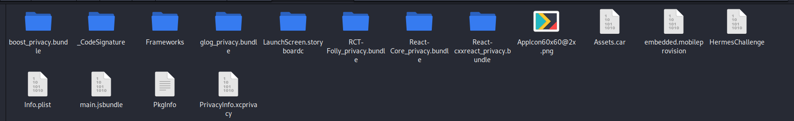
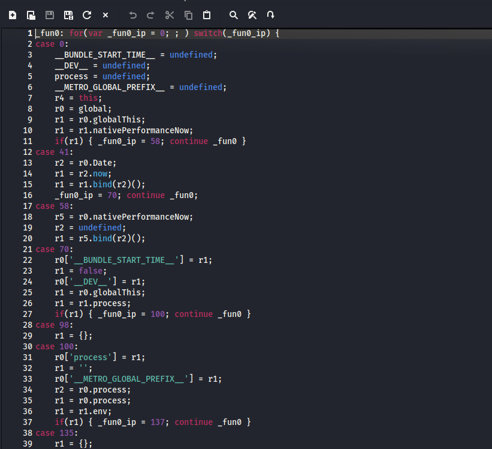
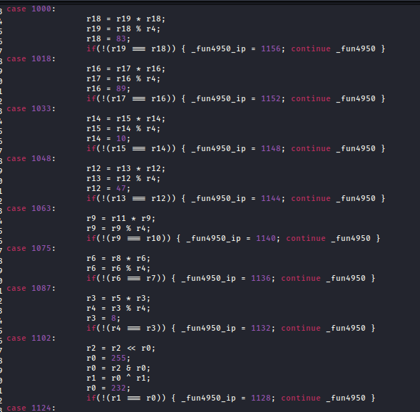
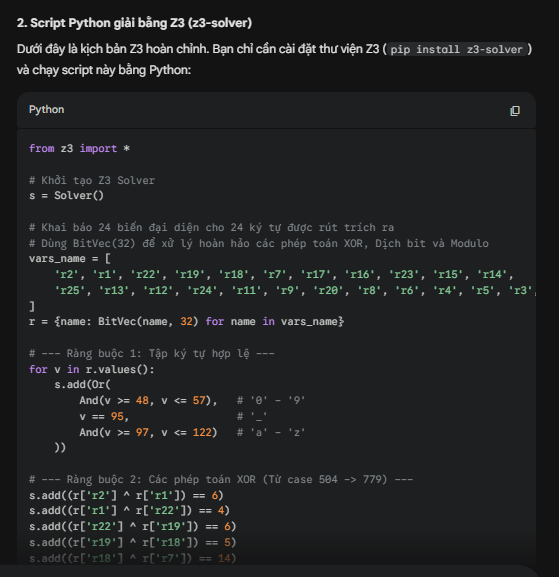

# Very cool native app

## Đề bài
Ta được cho 1 file .ipa

## Cách giải
Thực chất file .ipa là một file được nén, sau khi giải nén em thu được 1 thư mục Payload, ở trong đó có thêm 1 thư mục HermesChallenge.app. Trong thư mục đó em có:

Thư mục quan trọng em để ý ở đây là main.jsbundle, được sử dụng Hermes Engine để đưa về bytecode. Chính vì vậy, em sẽ sử dụng tool hermes-dis để Disassemble về mã giả. em thu được mã Assembly của Hermes, rồi tiếp tục dùng hermes-dec dịch ngược sang javascript. em thu được file .js như sau:

Ctrl + F tìm "BKSEC" em thấy 1 đoạn flag chưa đầy đủ cùng với tìm được 1 hàm xử lí đoạn sau flag. Đoạn xử lí quan trọng của hàm : 

Đoạn mã này gồm các phương trình tính toán với các kí tự của flag. Em nhờ AI tổng hợp hộ rồi dùng z3 để giải ra các kí tự cuối. 

